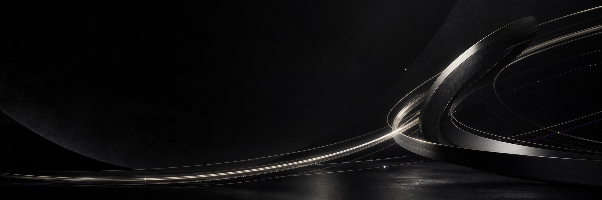
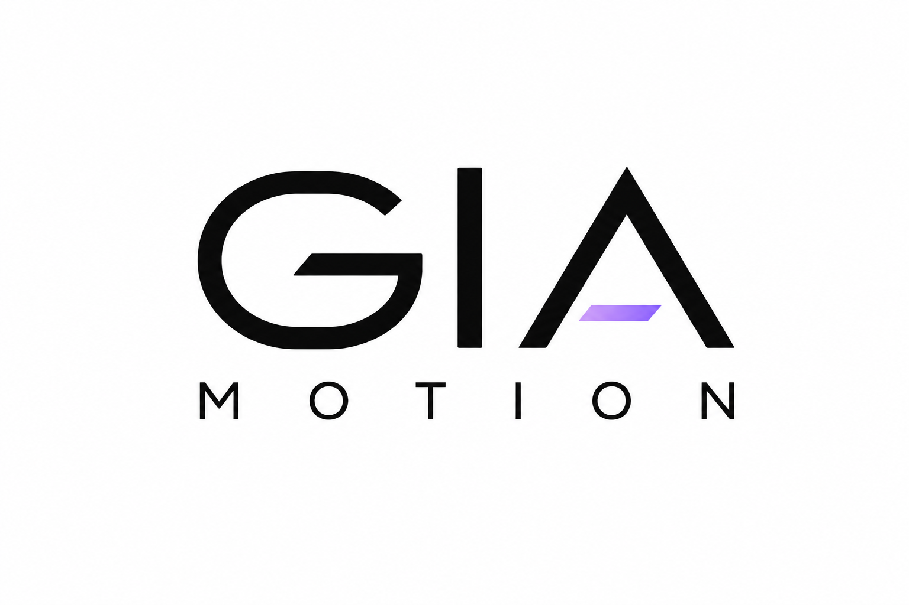
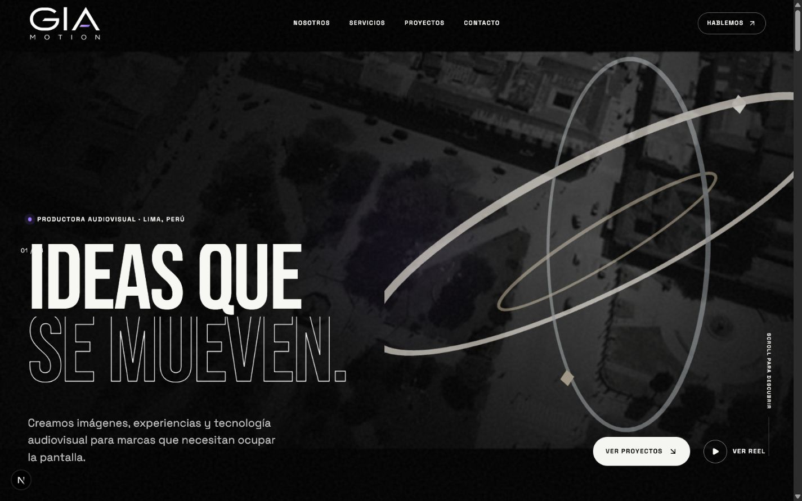
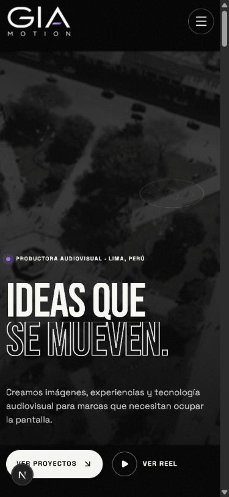
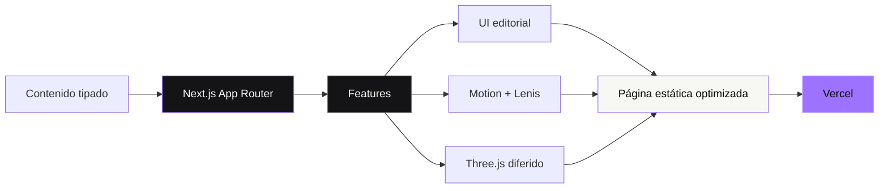
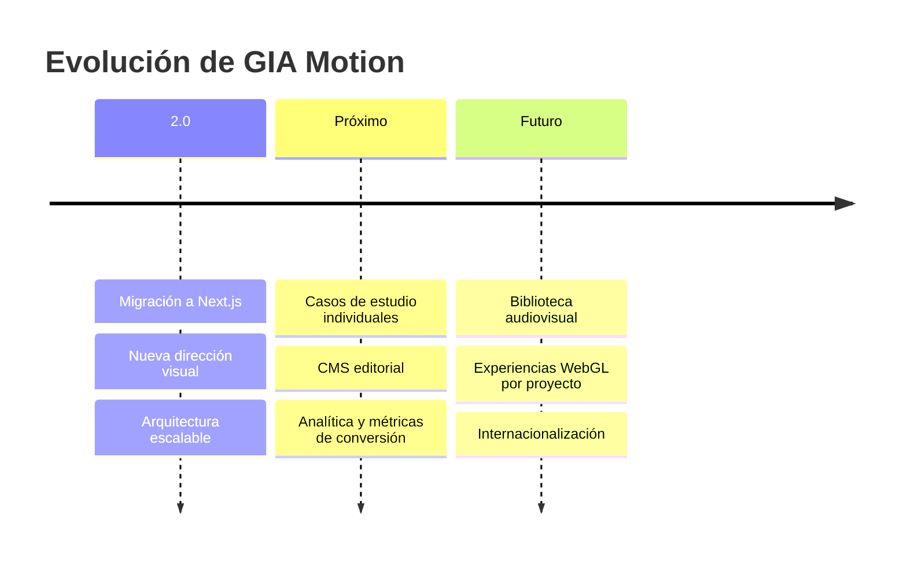

<div align="center">
  

  <br>
  <br>

  <picture>
    <source media="(prefers-color-scheme: dark)" srcset="./public/images/gia-logo.png">
    <source media="(prefers-color-scheme: light)" srcset="./public/images/gia-logo-master.png">
    
  </picture>

  <h1>Ideas que se mueven.</h1>

  <p>
    Plataforma digital cinematográfica para una productora audiovisual que combina<br>
    <strong>estrategia, producción, tecnología y movimiento.</strong>
  </p>

  <p>
    <a href="https://gia-motion-zeta.vercel.app"><strong>Ver experiencia en vivo</strong></a>
    ·
    <a href="#inicio-rapido"><strong>Ejecutar localmente</strong></a>
    ·
    <a href="./docs/ARCHITECTURE.md"><strong>Explorar arquitectura</strong></a>
  </p>

  <p>
    <a href="https://github.com/Jhan-ux/gio_motion/actions/workflows/quality.yml"></a>
    <a href="https://gia-motion-zeta.vercel.app"></a>
    
    
    
  </p>
</div>

---

## La experiencia

GIA Motion no se presenta como un catálogo tradicional. La interfaz construye una narrativa editorial en seis actos: identidad, servicios, proyectos, resultados, proceso y contacto. El resultado es una web completamente negra, precisa y expresiva, preparada para mostrar trabajo audiovisual sin competir con él.

<table>
  <tr>
    <td align="center"><strong>06</strong><br><sub>especialidades</sub></td>
    <td align="center"><strong>30 FPS</strong><br><sub>límite de la escena 3D</sub></td>
    <td align="center"><strong>360°</strong><br><sub>cobertura creativa</sub></td>
    <td align="center"><strong>100%</strong><br><sub>responsive</sub></td>
  </tr>
</table>

### Vista responsive

<table>
  <tr>
    <td width="72%">
      
    </td>
    <td width="28%">
      
    </td>
  </tr>
  <tr>
    <td align="center"><sub>Experiencia de escritorio con composición 3D reactiva</sub></td>
    <td align="center"><sub>Interfaz móvil adaptada y táctil</sub></td>
  </tr>
</table>

> [Explora el sitio publicado](https://gia-motion-zeta.vercel.app) para experimentar las transiciones, el reel y la escena interactiva.

---

## Lo que hace diferente al proyecto

| Dirección visual | Experiencia | Ingeniería | Rendimiento |
| --- | --- | --- | --- |
| Hero cinematográfico | Navegación contextual | Next.js App Router | Renderizado estático |
| Tipografía editorial | Reel en modal accesible | React 19 + TypeScript | Three.js diferido |
| Negro, marfil y violeta | Servicios interactivos | Contenido tipado | Escena limitada a 30 FPS |
| Fotografía industrial | Formulario orientado a leads | Arquitectura por features | AVIF, WebP y carga progresiva |

### Capacidades

- Producción audiovisual, fotografía industrial y streaming multicámara.
- Drone, topografía y experiencias inmersivas 360°.
- Portafolio editorial con contenido desacoplado del diseño.
- Animaciones basadas en `transform` y `opacity`.
- Scroll suave con Lenis y transiciones con Motion.
- Escena Three.js aislada del renderizado del servidor.
- Navegación por teclado, foco visible y movimiento reducido.
- Metadata, Open Graph, datos estructurados, sitemap y robots.

---

## Arquitectura



```text
src/
├── app/                  # Rutas, metadata, SEO y estilos globales
├── components/
│   ├── layout/           # Header, footer y sistema de marca
│   └── ui/               # Primitivas visuales reutilizables
├── content/              # Contenido editorial actual e histórico
├── features/
│   ├── hero/             # Portada, reel y escena Three.js
│   └── home/             # Secciones funcionales de la home
├── lib/                  # Configuración y utilidades sin interfaz
├── providers/            # Scroll suave y efectos globales
└── types/                # Contratos TypeScript

public/
├── images/               # Marca y fotografía optimizada
└── media/                # Reel oficial de GIA Motion
```

La explicación completa, las decisiones técnicas y el flujo de renderizado viven en [docs/ARCHITECTURE.md](./docs/ARCHITECTURE.md).

---

<a id="inicio-rapido"></a>

## Inicio rápido

### Requisitos

- Node.js 20 o superior
- npm 10 o superior

### Instalación

```bash
git clone https://github.com/Jhan-ux/gio_motion.git
cd gio_motion
npm ci
cp .env.example .env.local
npm run dev
```

Abre [http://localhost:3000](http://localhost:3000) en el navegador.

> En PowerShell usa `Copy-Item .env.example .env.local` para crear el archivo de entorno.

### Comandos

| Comando | Acción |
| --- | --- |
| `npm run dev` | Inicia el entorno local con recarga automática |
| `npm run build` | Genera la versión optimizada de producción |
| `npm run start` | Ejecuta el build de producción |
| `npm run lint` | Revisa calidad y convenciones del código |
| `npm run typecheck` | Valida los contratos TypeScript |

---

## Configuración

La web funciona sin secretos. WhatsApp se habilita únicamente al proporcionar estas variables:

```env
NEXT_PUBLIC_WHATSAPP_NUMBER=51987654321
NEXT_PUBLIC_WHATSAPP_LABEL=+51 987 654 321
```

| Variable | Descripción | Requerida |
| --- | --- | --- |
| `NEXT_PUBLIC_WHATSAPP_NUMBER` | Número internacional, solo dígitos | No |
| `NEXT_PUBLIC_WHATSAPP_LABEL` | Texto visible para el contacto | No |

Sin número configurado, el formulario prepara la consulta por correo electrónico.

---

## Calidad y rendimiento

Cada cambio pasa por un pipeline automatizado que ejecuta lint, validación TypeScript y build de producción.

- Three.js se carga dinámicamente y solo cuando el dispositivo puede aprovecharlo.
- La densidad de píxeles y la frecuencia de renderizado están limitadas.
- `next/image` entrega imágenes en formatos modernos.
- `prefers-reduced-motion` desactiva el movimiento no esencial.
- El menú móvil aísla correctamente el contenido de fondo.
- Los formularios incluyen etiquetas, autocompletado y estados anunciados.

```bash
npm run lint && npm run typecheck && npm run build
```

---

## Roadmap



Consulta el [roadmap detallado](./docs/ROADMAP.md) y el [historial de cambios](./CHANGELOG.md).

---

## Documentación

| Documento | Propósito |
| --- | --- |
| [Arquitectura](./docs/ARCHITECTURE.md) | Límites, flujo de datos y decisiones técnicas |
| [Guía de marca](./docs/BRAND_GUIDE.md) | Paleta, tipografía y reglas visuales |
| [Roadmap](./docs/ROADMAP.md) | Evolución propuesta por etapas |
| [Migración](./docs/MIGRATION.md) | Información preservada desde la versión PHP |
| [Contribución](./CONTRIBUTING.md) | Flujo de trabajo y estándares del proyecto |
| [Créditos](./CREDITS.md) | Procedencia de recursos visuales |
| [Constancia NovaTec](./docs/CONSTANCIA_NOVATEC.md) | Atribución de colaboración tecnológica |

---

## Colaboración tecnológica

<div align="center">
  <a href="https://www.novatec.ink">
    
  </a>

  <p>
    <strong>NovaTec</strong> colaboró en la modernización visual, el desarrollo y la arquitectura tecnológica de esta experiencia.
  </p>

  <p>
    <a href="https://www.novatec.ink"><strong>www.novatec.ink</strong></a>
    ·
    <a href="./docs/CONSTANCIA_NOVATEC.md"><strong>Ver constancia</strong></a>
  </p>
</div>

---

## Contribuir

Las mejoras son bienvenidas. Antes de abrir un cambio, revisa [CONTRIBUTING.md](./CONTRIBUTING.md) y utiliza las plantillas incluidas para issues y pull requests.

<div align="center">
  <br>
  <h3>GIA Motion</h3>
  <p><strong>Producción audiovisual · Cajamarca, Perú</strong></p>
  <p>Diseñado para convertir atención en movimiento.</p>
  <p>
    <a href="https://gia-motion-zeta.vercel.app">Sitio web</a>
    ·
    <a href="https://github.com/Jhan-ux/gio_motion/issues">Issues</a>
    ·
    <a href="https://github.com/Jhan-ux/gio_motion">Repositorio</a>
  </p>
</div>
