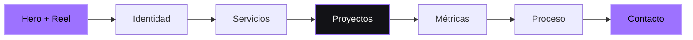

<div align="center">
  <picture>
    <source media="(prefers-color-scheme: dark)" srcset="./public/images/gia-logo.png">
    <source media="(prefers-color-scheme: light)" srcset="./public/images/gia-logo-master.png">
    
  </picture>

  <h1>Ideas que se mueven.</h1>

  <p>
    Experiencia digital para una productora audiovisual que combina<br>
    <strong>estrategia, producción, tecnología y movimiento.</strong>
  </p>

  <p>
    <a href="https://gia-motion.com"><strong>Explorar el sitio</strong></a>
    ·
    <a href="#-inicio-rápido"><strong>Ejecutar localmente</strong></a>
    ·
    <a href="#-arquitectura"><strong>Ver arquitectura</strong></a>
  </p>

  <p>
    
    
    
    
  </p>
</div>

---

## ✦ La experiencia

GIA Motion es una web editorial y cinematográfica diseñada para presentar servicios audiovisuales con la misma calidad visual que la marca entrega en cada producción.

La interfaz combina una dirección de arte completamente negra, tipografía de gran escala, acentos violetas, video, profundidad 3D y transiciones suaves. Cada recurso está pensado para producir impacto sin sacrificar accesibilidad, claridad ni rendimiento.

### Lo que la hace diferente

| Experiencia visual | Producto | Tecnología | Rendimiento |
| --- | --- | --- | --- |
| Hero cinematográfico | Formulario orientado a leads | Next.js App Router | Renderizado estático |
| Escena 3D reactiva | Reel dentro de una modal | React 19 + TypeScript | 3D diferido en escritorio |
| Navegación contextual | Servicios interactivos | Motion + Lenis | Animación limitada a 30 FPS |
| Portafolio editorial | Contacto por correo o WhatsApp | Three.js directo | Imágenes AVIF/WebP |

---

## ◉ Recorrido visual



La navegación identifica la sección visible y una línea superior muestra el progreso de lectura. En móvil, el menú aísla el contenido de fondo y mantiene una interacción clara mediante teclado, tacto o lector de pantalla.

---

## ⚡ Inicio rápido

### Requisitos

- Node.js 20 o superior
- npm 10 o superior

### Instalación

```bash
git clone https://github.com/giamotion6-cpu/gia_motion.git
cd gia_motion
npm ci
cp .env.example .env.local
npm run dev
```

Abre [http://localhost:3000](http://localhost:3000) en el navegador.

> En Windows PowerShell puedes copiar el archivo de entorno con `Copy-Item .env.example .env.local`.

---

## ⌘ Comandos

| Comando | Acción |
| --- | --- |
| `npm run dev` | Inicia el entorno local con recarga automática |
| `npm run build` | Genera la versión optimizada de producción |
| `npm run start` | Ejecuta el build de producción |
| `npm run lint` | Revisa calidad y convenciones del código |
| `npm run typecheck` | Valida todos los contratos TypeScript |

---

## ◇ Variables de entorno

El sitio funciona sin configuración privada. WhatsApp se activa únicamente cuando se proporcionan estas variables:

```env
NEXT_PUBLIC_WHATSAPP_NUMBER=51987654321
NEXT_PUBLIC_WHATSAPP_LABEL=+51 987 654 321
```

| Variable | Descripción | Requerida |
| --- | --- | --- |
| `NEXT_PUBLIC_WHATSAPP_NUMBER` | Número internacional, solo dígitos | No |
| `NEXT_PUBLIC_WHATSAPP_LABEL` | Texto visible para el número de contacto | No |

Cuando no existe un número configurado, el formulario genera una consulta por correo electrónico.

---

## ⌁ Arquitectura

```text
src/
├── app/                 # Rutas, metadata, SEO y estilos globales
├── components/
│   ├── layout/          # Header, footer y sistema de marca
│   └── ui/              # Primitivas visuales reutilizables
├── content/             # Contenido editorial actual e histórico
├── features/
│   ├── hero/            # Portada, reel y escena Three.js
│   └── home/            # Secciones de la página principal
├── lib/                 # Configuración y utilidades sin interfaz
├── providers/           # Scroll suave y efectos globales
└── types/               # Contratos TypeScript

public/
├── images/              # Marca y fotografías optimizadas
└── media/               # Reel oficial de GIA Motion
```

### Principios de diseño técnico

- **Separación por funcionalidades:** cada sección grande vive dentro de `features`.
- **Contenido desacoplado:** servicios, proyectos y métricas se administran desde `src/content`.
- **Límites cliente pequeños:** el hero se renderiza en servidor; Three.js y la modal se aíslan.
- **Carga progresiva:** la escena 3D solo se activa en escritorio y sin movimiento reducido.
- **Escalabilidad:** la estructura admite nuevas rutas, un blog, páginas de proyectos o un CMS.

Consulta la [arquitectura completa](./docs/ARCHITECTURE.md) y las [notas de migración](./docs/MIGRATION.md).

---

## ◎ Rendimiento y accesibilidad

- Escena WebGL limitada a **30 FPS** y densidad máxima de píxel controlada.
- Three.js cargado dinámicamente, fuera del renderizado del servidor.
- Imágenes servidas por `next/image` en AVIF o WebP.
- Animaciones basadas principalmente en `transform` y `opacity`.
- Compatibilidad con `prefers-reduced-motion`.
- Navegación por teclado, foco visible y enlace para saltar al contenido.
- Menú móvil con contenido de fondo inerte mientras está abierto.
- Formularios etiquetados, autocompletado y actualizaciones anunciadas.
- Metadata, Open Graph, `robots.txt`, `sitemap.xml` y datos estructurados.

---

## ☁ Despliegue

El proyecto está preparado para Vercel:

1. Importa el repositorio.
2. Vercel detectará automáticamente Next.js.
3. Configura las variables opcionales de WhatsApp.
4. Publica el deployment.

También puede ejecutarse en cualquier plataforma compatible con Node.js usando:

```bash
npm run build
npm run start
```

---

## ✺ Contenido y recursos

El logotipo y el reel pertenecen al material original de GIA Motion. Las imágenes editoriales externas y sus autores están documentados en [CREDITS.md](./CREDITS.md).

La información recuperada de la versión PHP se conserva en `src/content/legacy-catalog.ts`, evitando perder textos o referencias mientras la nueva experiencia continúa creciendo.

---

<div align="center">
  <h3>GIA Motion</h3>
  <p><strong>Producción audiovisual · Lima, Perú</strong></p>
  <p>Diseñado para convertir atención en movimiento.</p>
</div>
