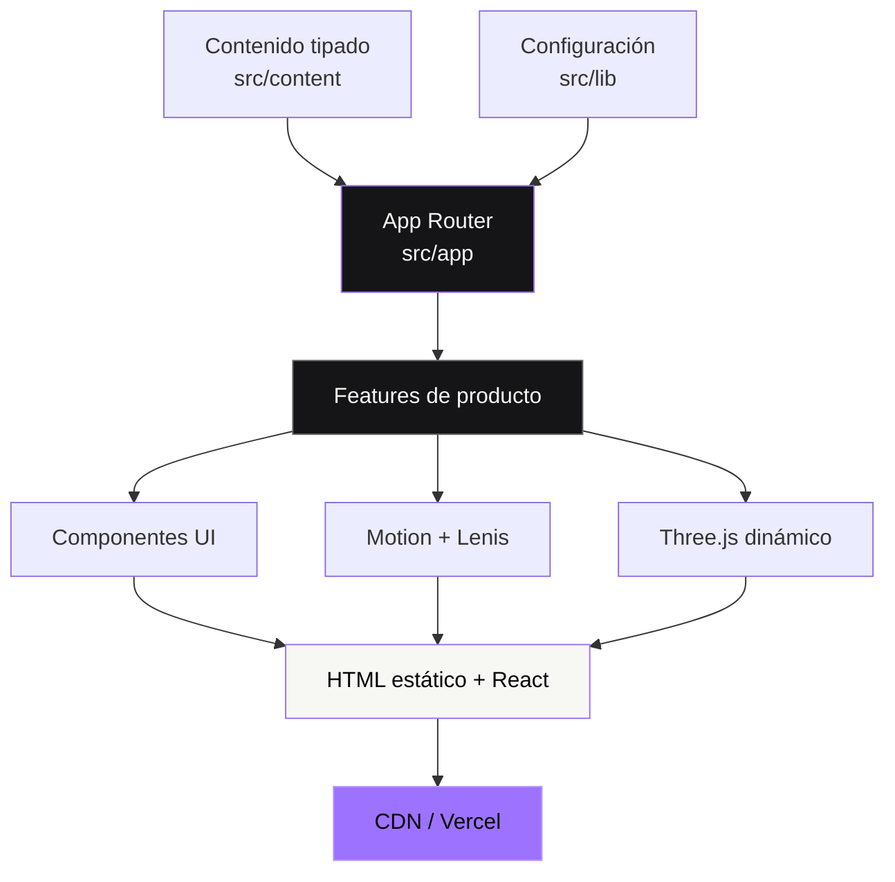
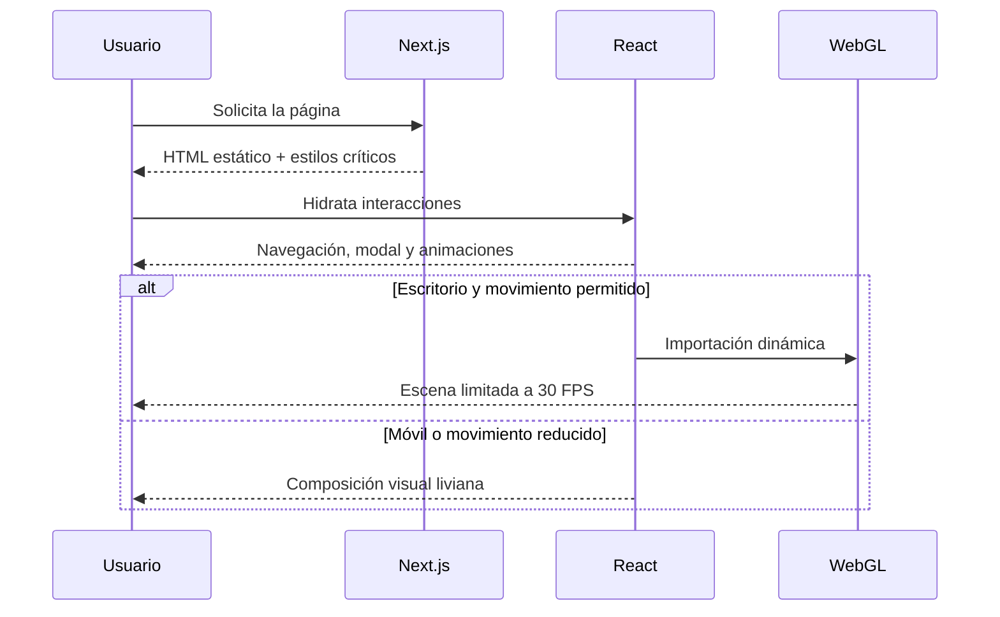

# Arquitectura de GIA Motion

> Una base editorial, escalable y orientada al rendimiento para experiencias audiovisuales.

## Visión general

GIA Motion utiliza Next.js App Router, React 19 y TypeScript. La arquitectura separa contenido, interfaz, interacción y configuración para que el producto pueda evolucionar hacia casos de estudio, blog, CMS o múltiples idiomas sin duplicar lógica.



## Capas

| Capa | Responsabilidad | Regla principal |
| --- | --- | --- |
| `app` | Rutas, metadata, SEO y composición | Mantenerla declarativa |
| `features` | Funcionalidades completas | Una carpeta por dominio visual |
| `components` | UI compartida y layout | Sin contenido de negocio embebido |
| `content` | Textos, servicios y proyectos | Contratos TypeScript estables |
| `providers` | Efectos globales del cliente | Límites cliente pequeños |
| `lib` | Configuración y funciones puras | Sin dependencias de UI |

## Estructura

```text
src/
├── app/                  Rutas, metadata y estilos globales
├── components/
│   ├── layout/           Header, footer y sistema de marca
│   └── ui/               Primitivas visuales reutilizables
├── content/              Contenido editorial actual e histórico
├── features/
│   ├── hero/             Portada, reel y escena 3D aislada
│   └── home/             Secciones de la página principal
├── lib/                  Configuración y utilidades sin UI
├── providers/            Comportamientos globales del cliente
└── types/                Contratos TypeScript

public/
├── images/               Marca y fotografías
└── media/                Reel original de GIA Motion
```

## Flujo de renderizado



## Decisiones de rendimiento

- El hero principal se renderiza en servidor.
- Three.js está aislado detrás de una importación dinámica.
- La escena limita densidad de píxeles y frecuencia de actualización.
- Las fotografías se procesan mediante `next/image`.
- Las animaciones priorizan `transform` y `opacity`.
- `prefers-reduced-motion` elimina movimiento no esencial.
- No existen barrels globales; las importaciones directas facilitan el tree-shaking.

## Cómo extender el proyecto

### Nueva página

Crear `src/app/<ruta>/page.tsx` y mantener la lógica de la funcionalidad en `src/features/<nombre>`.

### Nuevo proyecto audiovisual

Agregar el contenido al módulo correspondiente en `src/content`; la vista debe consumir el contrato existente sin repetir estructura visual.

### CMS

Implementar un adaptador dentro de `src/lib` o `src/content`. Los componentes deben continuar recibiendo los mismos tipos para evitar acoplar la UI al proveedor.

### Nueva escena 3D

Mantenerla dentro de una feature, cargarla dinámicamente y ofrecer una alternativa estática para móvil, batería reducida y `prefers-reduced-motion`.

## Reglas de crecimiento

1. El contenido no se escribe directamente en componentes grandes.
2. Los efectos globales viven en providers y deben poder desmontarse.
3. Una dependencia nueva requiere una razón que justifique su peso.
4. Toda interacción debe funcionar con teclado y movimiento reducido.
5. Cada cambio debe pasar lint, typecheck y build.
