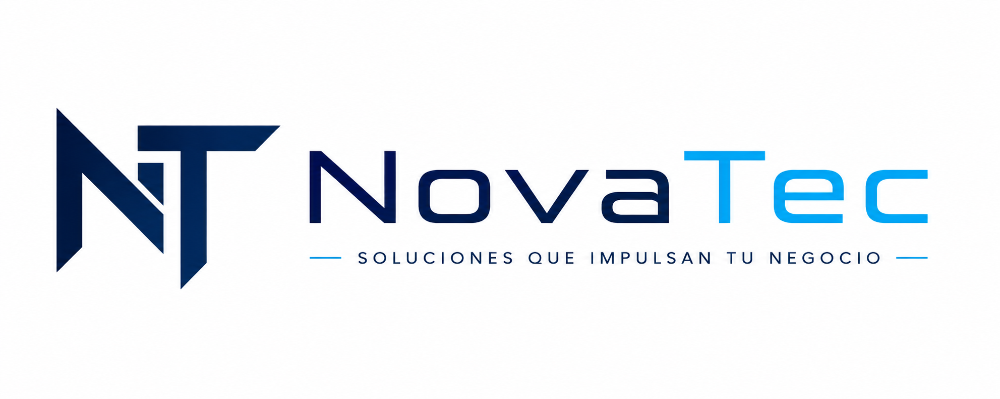

 

  

  <h1>Constancia de colaboración tecnológica</h1>

  
<strong>GIA Motion · Sitio web oficial</strong>

---

### Declaración

Por medio de la presente, se deja constancia de que **NovaTec**, bajo la dirección de su CEO, **Luis Armando**, colaboró activamente en la creación y evolución tecnológica del sitio web de **GIA Motion**.

La participación comprendió labores de **diseño de experiencia**, **desarrollo web**, **modernización visual**, **optimización de rendimiento** y **mejora de la arquitectura de software**, preservando la identidad, la información y los recursos originales del proyecto.

Esta colaboración contribuyó a construir una plataforma moderna, escalable y preparada para futuras etapas de crecimiento.

### Alcance acreditado

| Área | Contribución |
| --- | --- |
| Dirección tecnológica | Definición del enfoque técnico y visual de la nueva experiencia |
| Arquitectura | Migración y organización escalable del proyecto con Next.js y TypeScript |
| Diseño digital | Interfaz cinematográfica, responsive y orientada a la identidad de GIA Motion |
| Interacción | Animaciones, transiciones y recursos 3D optimizados |
| Calidad | Mejoras de accesibilidad, rendimiento, SEO y mantenibilidad |

### Firma y sello institucional

<table>
  <tr>
    <td align="center" width="50%">
        
      <strong>Luis Armando</strong> 
      CEO de NovaTec 
      <em>Firma institucional declarativa</em>
    </td>
    <td align="center" width="50%">
       
      <em>Sello visual de marca</em>
    </td>
  </tr>
</table>

  
<strong>Emitida el 30 de julio de 2026 · Cajamarca, Perú</strong>

  

    <a href="https://www.novatec.ink"><strong>www.novatec.ink</strong></a>
  

---

Esta constancia documenta la atribución de colaboración tecnológica declarada por el responsable de NovaTec dentro del repositorio del proyecto. El sello mostrado corresponde a la identidad visual de la marca y no sustituye una firma manuscrita o certificado criptográfico.
